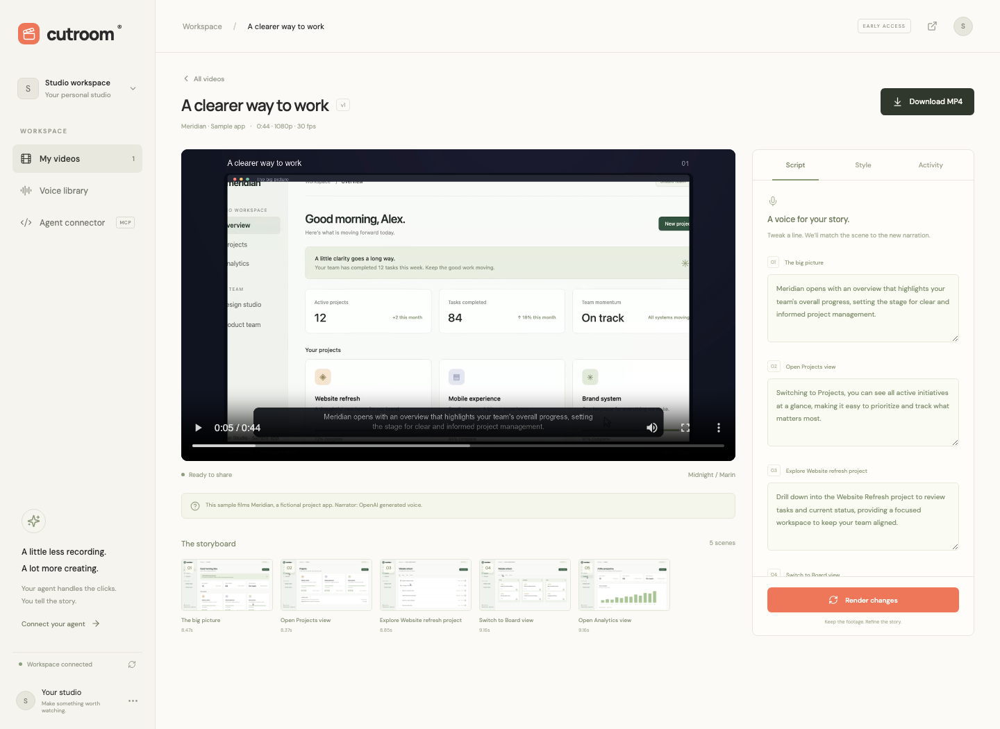

# Cutroom

**Your agent’s product video studio.** Give it a deployed app URL, a feature brief, and optional demo login credentials. Get an editable, narrated launch film: animated reveals, full-screen product footage, concise narration, clean cuts, and background music.

The web app and authenticated MCP connector use the same jobs, voices, storyboard, and exports. This is a working hackathon prototype, not a billing-enabled production service.



## Run locally

Requires Node 22+, Python 3.12+, Docker, and Supabase CLI.

```sh
npm ci
npx playwright install chromium
python3.12 -m venv .venv
.venv/bin/pip install -r requirements.lock
supabase start -x vector,imgproxy,edge-runtime,logflare
supabase migration up --local
python3 scripts/local_env.py
```

Add `OPENAI_API_KEY` to `.env` for browser reasoning and narration. An optional `ANTHROPIC_API_KEY` can direct the browser instead. Organization-wide Claude keys also require `ANTHROPIC_WORKSPACE_ID`; set `CUTROOM_DIRECTOR=claude` to explicitly select Claude. Otherwise the director uses OpenAI, or Claude when its workspace ID is configured.

```sh
npm run server
```

In another terminal:

```sh
npm run dev
```

Open **http://127.0.0.1:5173**. The browser creates an anonymous Supabase workspace with refreshable authentication. For hosted Supabase, enable anonymous sign-ins and apply the migrations. Anonymous accounts are a prototype convenience: clearing browser storage loses access to that account. A production SaaS needs permanent accounts and recovery.

`LOCAL_DEMO_MODE=true` explicitly enables a shared offline SQLite workspace. It is for local development only, not multi-user hosting.

## Make a film

1. Select **Create a video** and provide the deployed app URL.
2. Describe the feature and the outcome to show. Add an email/username, password, and optionally a separate login URL for a demo account.
3. Choose a narrator, target duration, background music, and visual style.
4. The director inspects visible controls and screenshots, selects bounded browser actions, and captures actual interactions. Login happens in an unrecorded browser; its session transfers to the recording context.
5. The script is generated from captured scenes and visible app text. Launch scripts use short benefit-focused lines. Routine navigation can be filmed as a ready destination; feature interactions retain their cursor movement. Model thinking time is cut out.
6. Review the film and its storyboard. Choose a scene in **Script**, edit its spoken words, and use **Hear these words** to preview the actual narration. Cut/restore, duplicate, reorder, and trim captured scenes. Edit title headlines and supporting lines independently of the voiceover.
7. Set each shot’s duration and choose a steady full-screen camera or gentle push toward the action. Choose a clean cut, dissolve, or dip to black. **Render changes** uses the existing capture and produces a 1080p, 30 fps MP4. Trims change the footage window. Long captures speed up to fit the shot; short captures hold their final frame. Longer edited narration extends the shot so speech is never cut off.

The default **Launch film** targets 30 seconds, with 2–4-second shots, brief animated typography, full-screen product footage, and clean cuts. Opening and spotlight reveals expand the exact first frame of the following trimmed shot to fill the canvas. The redundant overview is cut but can be restored. Typography is silent by default, reserving narration for product footage. **Product walkthrough** keeps only browser footage. In existing projects, **Add launch sequence** drafts opening, benefit, and closing copy and shortens narration from the verified captured scenes. Every line remains editable. Cuts are non-destructive: original captures remain intact, and a cut scene can be restored.

New launch plans use frame-driven **Remotion** compositions: continuous product reveals, layered interface details, a closer camera that returns to the overview, and masked word reveals. Browser capture records at 1080p and saves higher-resolution screenshots of visible interface regions. When fewer than two verified regions are available, the layered treatment uses a complete-screen reveal instead. Result shots are matched against their captured screen evidence to correct recording-clock drift before scripting; unverifiable results stop the take for review. In **Script → Motion treatment**, choose or remove a treatment for each shot; MCP accepts the same `motion` field (`none`, `reveal`, `panels`, `detail`, `resolve`). Old saved timelines keep their original rendering until edited. Long speech still extends its shot; the composition is retimed with it.

The worker renders reviewed compositions rather than executing generated code. It serves only the current job’s allowlisted assets on a temporary loopback server, bundles fonts locally, and caches the compiled composition plus unchanged rendered shots. Cancellation stops the compositor process group. Original captures, credentials, and unrelated files are not copied into the composition bundle. Remotion is source-available with [license conditions](https://www.remotion.dev/docs/license/faq); evaluate the applicable license before commercial scaling.

The renderer uses original synthesized instrumental beds, automatically mixed and ducked under speech. Voice and music are loudness-normalized separately, with gentle ducking and a final peak limiter; the momentum bed includes bass and percussion. Motion compositions add restrained, original sound cues on their actual edit boundaries. It does not require a music-generation API or external music assets. The actual duration depends on shot budgets, generated speech, and the number of captured scenes. Edited long narration is preserved and can exceed the target; the editor flags likely overruns.

The **sample app** is Meridian, a fictional project workspace bundled in `public/sample/`. With API keys it uses the real director and speech pipeline. Without reasoning keys, the sample uses a deterministic four-action path. On macOS without a speech key it uses the local system narrator; on other systems the unconfigured sample is silent. These fallbacks are labelled. They are not evidence of autonomous execution on an arbitrary app.

## Voices

- **Stock narrators:** OpenAI `gpt-4o-mini-tts`, with preview buttons and selection in the brief/editor. Generated narration is labelled as synthetic speech.
- **Your voice from a sample:** configure `ELEVENLABS_API_KEY` with access to Instant Voice Cloning. Upload an audio sample and confirm speaker consent. The sample is sent to ElevenLabs; Cutroom saves the returned voice ID in the user’s workspace, not the sample recording. Voice cloning is an optional provider integration and requires account access; it is not provided by ordinary OpenAI credits.
- **Your finished narration:** upload an audio file in a finished film’s script editor, then render changes. It is divided across scenes in proportion to script word counts. This is an audio replacement, not cloning or word-level forced alignment.

Keys stay on the server. Provider configuration is reread for each request so local keys can be added without exposing them in the client. Supabase URLs/Auth configuration and the preview signing key require an API restart. See `.env.example`.

## Animation and technology

| Layer | Implementation |
| --- | --- |
| Browser direction and copy | OpenAI Responses; optional Claude |
| Actual app footage | Isolated Playwright Chromium |
| Stock narration | OpenAI `gpt-4o-mini-tts` |
| Custom voice cloning | Optional ElevenLabs |
| Background music | Original local NumPy synthesis; FFmpeg ducks it under speech |
| Editable motion graphics | Remotion/React compositions with real product assets; legacy Pillow titles remain supported |
| Generated visual backgrounds | Optional Google Veo 3.1 Fast through Gemini API, or OpenAI Sora 2 |
| Composition and transitions | FFmpeg, including synchronized video dissolves and audio crossfades |
| Workspace and private exports | Supabase Auth, Postgres/RLS, Storage |

Built-in motion graphics work without a video-generation service. Their text is rendered from the editable timeline, with real captured imagery for product reveals. **Animation** can request one four-second 720p visual using provider credits. Configure `GEMINI_API_KEY` for Veo, or `OPENAI_API_KEY` for Sora. Model availability in a key's model list does not guarantee video-endpoint access or generation quota. The tested Gemini key lists Veo but currently returns a generation quota/billing error; the tested Sora endpoint returns 404. These integrations are implemented and provider contracts are tested, but a successful live model-generated clip has not been verified with these accounts.

Completed clips appear in the workspace's animation assets. **Add to timeline**, position the clip, edit its separately composed headline/narration, and render. Generated source audio is discarded to keep one coherent narrator and music bed. Failed generation preserves the existing film and timeline draft. Generated visuals are abstract launch imagery; the app itself is always represented by actual captured footage.

The editor uses a source-referenced, non-destructive timeline and explicit transition timing. Remotion provides composition and frame rendering; our editor, motion designs, and shot orchestration are original. Earlier editor research included [OpenCut](https://github.com/OpenCut-app/OpenCut). The supplied [LangEase launch reference](https://www.youtube.com/watch?v=SgmuplXU2iY) informed the direction; only public reference stills were accessible, so exact pacing could not be inspected.

## MCP connector

Open **Agent connector** to copy the endpoint and your current workspace Bearer token.

```sh
claude mcp add --transport http cutroom http://127.0.0.1:8000/mcp --header "Authorization: Bearer <workspace-token>"
```

For a remote agent, replace localhost with the deployed server origin.

| Tool | Purpose |
| --- | --- |
| `create_product_video` | Submit URL, brief, optional credentials, narrator, target duration, and style. Returns a job ID. |
| `get_video` | Poll status, progress, scenes, editable narration, and export metadata. |
| `list_videos` | List this authenticated workspace’s projects. |
| `list_voices` | List stock narrators and this workspace’s custom voices. |
| `render_video` | Edit narration, voice, music, or theme without another capture. |
| `export_video` | Return a private MP4 playback/download URL valid for 30 minutes. |
| `cancel_video` | Cancel at the next stage boundary. |
| `plan_launch_video` | Draft editable opening, benefit, and closing scenes from verified product footage. |
| `generate_animation` | Request one four- or eight-second Veo/Sora visual and poll the video's assets. |

Submit a job and poll `get_video` until complete, failed, or cancelled. Then call `export_video`. The prototype supports authenticated Streamable HTTP and has been checked with the official MCP SDK. Session tokens expire; this implementation does **not** include a public OAuth discovery/authorization flow for one-click connector installation.

`render_video` accepts `clips` from the project's `payload.timeline`, including source references, enabled flags, order, trims, shot duration, camera (`wide` or `push`), exact narration, title copy, and transitions. Legacy `narration` arrays remain supported for browser-only edits. `audio_source=generated` regenerates edited spoken words; `uploaded` uses an existing uploaded recording. Playback returns exported `timeline_start` values that account for transition overlaps, so storyboard seeking matches the actual film.

Example prompt:

> Create a 30-second launch film of my deployed app. Use the demo login, show how a user opens a project and views its board, narrate with Marin, and add quiet ambient music. Return the MP4 when ready.

## Structure

- `src/studio/`: React/TypeScript studio, brief form, storyboard editor, voice library, and connector setup.
- `server/studio.py`: authenticated REST API, private media links, voice uploads, and MCP.
- `server/video_service.py`: job coordination, browser director, scripting, and revisions.
- `server/video_providers.py`: OpenAI, Claude, and ElevenLabs adapters.
- `server/video_render.py`: FFmpeg composition, captions, narration alignment, and synthesized music.
- `server/video_timeline.py`: immutable source references, trim validation, cut/order edits, launch drafts.
- `server/video_motion.py`: original typography and product-reveal animation renderer.
- `src/video/`: reviewed Remotion compositions, typography, camera movement, and product-layer animation.
- `server/video_composition.py`, `scripts/render_motion.mjs`: private asset preparation, cached rendering, and cancellation.
- `server/video_generation.py`: bounded Veo/Sora creation, polling, and private downloads.
- `scripts/video_browser.mjs`: isolated Playwright capture worker. Credentials enter through stdin and never appear in project metadata.
- `supabase/migrations/20261004000100_cutroom.sql`: user-scoped Postgres jobs/voices, Realtime, and private Storage.
- `public/sample/`: original fictional sample app and a basic login page for capture verification.
- `.cutroom/`: ignored browser captures, render intermediates, and local verification artifacts. Never commit this directory.

Prior Trace source and deterministic tests are retained for reference. `npm run server:trace` starts its API on port 8001; the current frontend is Cutroom. The older Forge project remains in `archive/forge-v1`.

## Validation

The short-film integration produced a 22.8-second narrated 1080p sample through MCP, including capture, launch planning, camera controls, revision, and private export. Built-in animation required no video-generation API.

```sh
npm run build          # TypeScript checks and production frontend build
npm run lint           # Ruff and Prettier
npm test               # Deterministic backend tests; no provider credentials required
npm run test:mcp       # Official MCP SDK handshake and tools against real Supabase
npm run test:video:e2e # Full web flow, real capture, narration, render, private playback, MCP export
npm run test:login     # Basic login, session transfer, incorrect-credential rejection
npm run test:public    # Public deployed test app → MCP → actual narrated MP4; requires provider keys
npm run test:revision  # Run after test:video:e2e; edit narration/voice/style through MCP and export again
npm run test:launch    # Run after test:video:e2e; MCP creates and exports a short narrated launch film
npm run test:editing   # Run after test:video:e2e; real UI word edits, cuts, trims, launch animation and export
```

The API and Vite servers must be running for integration checks. End-to-end verification uses configured model/speech credits when available and writes an actual film and screenshots under `.cutroom/verification/`. Without keys it uses the labelled sample fallbacks. Existing Trace browser/stack checks apply only to the prior Trace app.

To reproduce Cutroom’s own directed launch film, first run `test:video:e2e` and `test:launch` to create the private verification workspace and its sample film. Run `node scripts/capture_studio_launch.mjs`, then `.venv/bin/python -m scripts.render_studio_launch`. This records the actual local UI and renders a narrated 1080p film under `.cutroom/verification/cutroom-launch/film.mp4`. Narration uses OpenAI credits. Pass `--reuse-audio` to the render command only when the spoken copy is unchanged. This is a scripted capture of our studio, not a test of autonomous URL-only navigation.

For the two short motion treatments, run `node scripts/capture_motion_preview.mjs` then `.venv/bin/python -m scripts.render_motion_previews`. These use the same actual editor capture, product-element screenshots, and narration to compare the reveal and layered treatments under `.cutroom/verification/motion-v2/{reveal,panels}/film.mp4`. This is a directed comparison through the normal rendering engine. A 1–5 opening-variation selector, repository ingestion, and a standalone customer CLI are not implemented yet; URL input and the existing authenticated MCP remain the supported entry points.

The public-URL check uses Playwright's TodoMVC demo, which stores task changes only in that browser's localStorage. It verifies a real deployed URL with the sample shortcut disabled. This is a tested example, not a benchmark across arbitrary apps. The Docker runtime has also passed a full offline sample capture, FFmpeg render, and signed MP4 playback check under its non-root user.

## Hosting and practical limits

### Vercel studio + persistent video worker

The repository includes `vercel.ts`: Vite builds into `dist`, while `/api/*`, `/mcp`, and `/media/*` are proxied to `CUTROOM_WORKER_ORIGIN`. Set that variable to the worker’s public HTTPS origin in Vercel and redeploy. Without it, the studio loads with a clear unavailable state; video creation and MCP are not operational.

```sh
npx vercel@latest link --project supabase-select-2026 --scope shoadachi01s-projects
npx vercel@latest env add CUTROOM_WORKER_ORIGIN production
npx vercel@latest deploy --prod
```

Deploy the existing Dockerfile to a persistent container host with a volume at `/data`, one worker process, and the variables in `.env.example`. Use the hosted Supabase URL and publishable/anon key, apply the Cutroom migration, and enable anonymous sign-ins. Keep provider keys on the worker. Set `CUTROOM_PUBLIC_ORIGIN` to the Vercel production URL and `CUTROOM_SAMPLE_ORIGIN` to the worker origin. Localhost Supabase cannot be used by a hosted worker.

Vercel's function/container execution model does not preserve this worker’s in-process job queue or local captures across instances. Hosting the entire pipeline there would require durable job orchestration and remote source-artifact storage. The current split deployment preserves editing and long-running renders.

`.vercelignore` limits CLI uploads to frontend/configuration files and the unavailable-service handler; private captures, environment files, and internal documents remain local.

`npm run build` and `.venv/bin/python scripts/serve.py` serve the frontend and API together on `PORT` (default 8000).

The Dockerfile includes Chromium, Node, Python, FFmpeg, and fonts:

```sh
docker build -t cutroom .
docker run --env-file .env -e CUTROOM_SAMPLE_ORIGIN=https://your-deployed-origin -e CUTROOM_SIGNING_KEY=your-long-random-value -p 8000:8000 -v cutroom-data:/data cutroom
```

Use hosted Supabase credentials inside the container; `127.0.0.1` inside Docker does not refer to the host’s Supabase service. Apply migrations before startup. Never bake API keys into the image. This worker requires a long-running container or VM; it is unsuitable for a short-lived serverless function.

Run one API worker. Two browser/render jobs run concurrently; each workspace may queue up to three unfinished jobs. Job metadata and completed MP4s persist in Supabase, with RLS and a private bucket. Captures, thumbnails, uploaded narration, and render inputs remain on the worker’s persistent volume. Editing therefore requires the worker that owns the original capture. Interrupted jobs are marked failed on the next read, rather than silently restarted. Cancellation takes effect at stage boundaries.

Before public launch, add a durable task queue, distributed capture/artifact storage, stable API credentials or OAuth, permanent accounts, billing/quotas, spend controls, and a hardened browser sandbox with network egress restrictions. Basic URL/route checks block private network targets; they are not a replacement for infrastructure-level isolation on a public browser service.

Basic email/password logins are supported. MFA, CAPTCHA, email-first multi-step sign-in, and sessionStorage-only authentication may need an interactive login extension. Destructive actions, purchases, sending messages, and inviting people are excluded from the browser action set. The director is bounded to eight selected actions, so complex features need a focused brief.

The exporter retains real recorded interactions and uses full-screen framing, matched product reveals, gentle camera pushes, clean cuts, and optional dissolves. It does not generate imaginary product screens. Captions currently show one condensed block per scene, not word-level karaoke captions. The editor supports scene-level cuts and source trims, not arbitrary frame splitting or multi-track keyframe editing. No commercial-quality claim or arbitrary-site success rate is implied by the sample demo.
