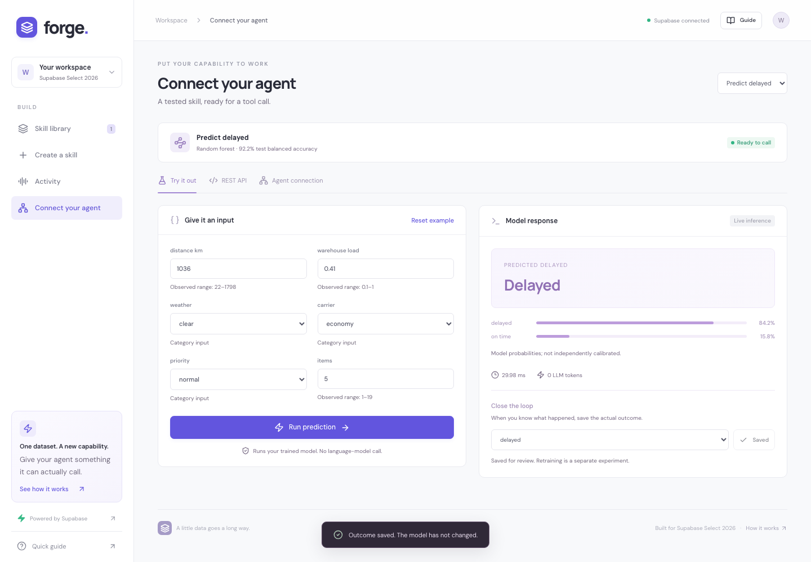

# Forge

**Give your agent a tested prediction skill from a CSV.**

Agents can reason about a business question, but numerical prediction often needs a model trained on the relevant data. Forge turns labeled tabular data into a reusable tool: inspect the data, confirm the task, compare three methods, evaluate the winner on an untouched test set, and call it through REST or MCP.

Built for Supabase Select 2026. Training and prediction work without an LLM API key.



## What works

- CSV upload and three sample datasets: simulated shipment delays, simulated building energy demand, and the public UCI wine dataset bundled with scikit-learn.
- Classification and regression, missing-value handling, categorical encoding, and warnings for identifiers, high-cardinality text, and likely post-outcome fields.
- A 60/20/20 train/validation/test split, with either stratified random classification splits or chronological evaluation. Preprocessing fits on training data only; model selection uses validation data.
- Comparison against a simple baseline. Classification reports balanced accuracy; regression reports mean absolute error. The baseline can win.
- Live experiment traces, validation permutation importance, input checks, model predictions, and saved actual outcomes.
- Authenticated REST and stateless Streamable HTTP MCP tools. Predictions execute scikit-learn models; they make no language-model call.

## Run locally

Requirements: Node.js 20.19+ or 22.12+, Python 3.12, Docker, and the [Supabase CLI](https://supabase.com/docs/guides/local-development).

```sh
npm ci
python3.12 -m venv .venv
.venv/bin/pip install -r requirements.lock
supabase start -x vector,imgproxy,edge-runtime,logflare
python3 scripts/local_env.py
```

The checked-in migration is applied on first start. The configuration enables anonymous Auth. The environment script writes local public connection settings to an ignored `.env` without printing credentials.

In two terminals:

```sh
npm run server
npm run dev
```

Open **http://127.0.0.1:5173**. Supabase Studio is at http://127.0.0.1:54323. Follow [the two-minute demo](docs/DEMO.md).

Optional: add `ANTHROPIC_API_KEY` to `.env` and restart the server for natural-language task planning. Without it, the interface explicitly uses schema-guided suggestions. You always confirm the target and features. With it, column profiles and the objective are sent to Anthropic; training and prediction remain local.

## Supabase integration

Supabase provides anonymous Auth, Postgres records, private Storage for CSVs and generated artifacts, and Realtime experiment updates. Every request uses the caller's JWT and the public project key. Row-level policies restrict both records and storage paths to their owner; relationship policies reject runs referencing another user's dataset. No service-role key is needed.

Your browser retains its anonymous workspace session. Clearing browser storage loses access to that workspace. This demo does not support account recovery.

## Connect an agent

Train a skill, then open **Connect your agent → Agent connection**. Copy the MCP configuration and workspace token into a client supporting HTTP transports with custom authorization headers. The endpoint is `/mcp`; `tools/list` discovers your trained skills and `tools/call` executes them. This demo uses bearer tokens, not an OAuth connector flow; tokens expire and should be kept private.

The REST tab provides a generated curl example and JSON tool schema. `GET /api/runs/{id}/feedback` exports saved prediction/outcome pairs for review. Feedback does **not** automatically retrain or update a model.

## Verify

Start the API, frontend, and Supabase before integration checks:

```sh
npm run build
npm test
npm run lint
npx playwright install chromium
npm run test:e2e
npm run test:stack
npm run test:mcp
```

Unit tests check input validation and final-holdout independence. Browser tests cover training, inference, feedback, persistence, upload, and mobile layout. Integration checks exercise real Supabase Auth/Storage/RLS, cross-user isolation, and the official MCP client. Integration tests create disposable anonymous workspaces.

## Structure

| Path | Responsibility |
| --- | --- |
| `src/` | React interface, typed API client, and styles |
| `server/app.py` | FastAPI endpoints, background experiments, and MCP |
| `server/ml.py` | Profiling, sample data, training, evaluation, and inference |
| `server/store.py` | Auth and user-scoped Supabase persistence |
| `supabase/migrations/` | Tables, RLS, private bucket, and Realtime publication |
| `tests/`, `scripts/` | Unit/browser tests and integration checks |

## Deploy

For a hosted Supabase project, apply `supabase/migrations/20261003204500_forge.sql` in its SQL editor, enable anonymous sign-ins in Auth, and set `SUPABASE_URL`, `SUPABASE_ANON_KEY`, and `LOCAL_DEMO_MODE=false` in the API environment. Enable appropriate anonymous signup protections before sharing broadly.

```sh
docker build -t forge .
docker run --rm -p 8000:8000 --env-file .env -v forge-models:/data forge
```

Use a hosted Supabase URL when running this container; `127.0.0.1` inside Docker does not address the host's local stack. The image serves the built frontend and API together; `PORT` controls its listening port. Keep a persistent `/data` volume and a single API worker. Models execute from locally generated artifacts and are never deserialized from uploaded files or restored from remotely writable Storage. Losing the volume requires retraining. For a non-container production preview, run `npm run build` followed by `.venv/bin/python scripts/serve.py`.

## Scope and limitations

Use non-sensitive labeled datasets: 50–25,000 rows, 2–50 columns, CSVs up to 5 MB. Classification supports 2–20 classes with at least five examples per class. Two concurrent experiments are allowed per worker; training jobs are in-process and do not survive worker restarts. `LOCAL_DEMO_MODE=true` is an explicit, shared offline fallback; it is not a multi-user deployment.

Field-name heuristics cannot discover every kind of leakage. Confirm that inputs are available before the outcome; use chronological evaluation for time-dependent tasks. Probabilities are not independently calibrated, permutation importance is not causal, and synthetic sample performance is not evidence of production quality. Forge does not yet provide automatic retraining, model monitoring, pretrained-model discovery, or billing.
