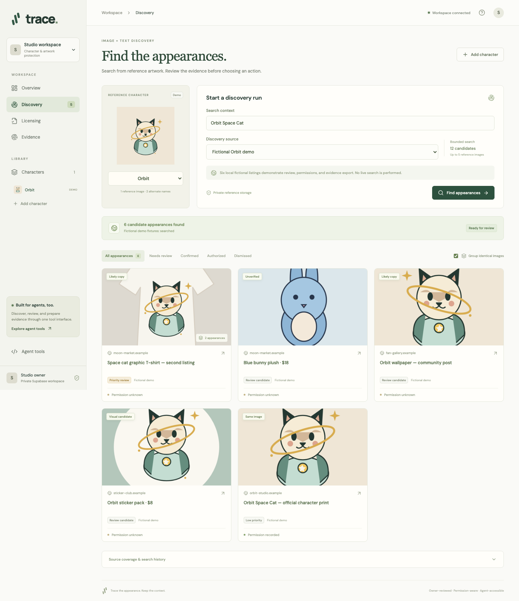

# Trace

**Find online appearances of character artwork, review permission context, and prepare evidence.**

Trace gives owners and their agents a connected workflow: reference images → scoped search → visual comparison → owner review → licensing records and evidence handoff.



## Run locally

Requires Node 20+, Python 3.12+, Docker, and the Supabase CLI.

```sh
npm ci
python3.12 -m venv .venv
.venv/bin/pip install -r requirements.lock
supabase start -x vector,imgproxy,edge-runtime,logflare
supabase migration up --local
python3 scripts/local_env.py
npm run server
```

In another terminal:

```sh
npm run dev
```

Open **http://127.0.0.1:5173**. Enable anonymous sign-ins if using a hosted Supabase project. The workspace persists in the browser's Supabase session; clearing that session loses access to its anonymous account. For deployment, add permanent accounts and account recovery.

For an explicit shared offline workspace, set `LOCAL_DEMO_MODE=true` in `.env`; this uses local SQLite and files instead of Supabase. It is not a multi-user deployment mode.

## What works

- Register up to five uploaded or publicly accessible reference images, character names, and visual context.
- Search real Wikimedia Commons and Openverse collections without credentials; inspect supplied public image or HTML-page URLs.
- Compare normalized pixels and perceptual fingerprints across reference images and bounded candidate crops. View evidence side by side; fingerprint distance is not a calibrated probability.
- Group identical candidate images within a search and prioritize review using visible matching, commercial signals, owner decisions, and permission records.
- Record licensing inquiries. Only an explicit owner approval creates a permission record; checks require the exact domain, category, territory, and current date. Unknown scope stays unresolved.
- Retain owner review history. A subsequent scan reuses match or rejection feedback for identical decoded image pixels belonging to the same character. Authorization never transfers merely because an image matches.
- Export ZIP bundles containing captured PNGs, reference artwork, SHA-256 digests, review history, source details, and questions for the owner or counsel. Supplied HTML-page inspections also retain the fetched HTML.
- Expose seven authenticated tools through Streamable HTTP MCP at `/mcp`.

## Search providers

| Provider | Configuration | Coverage and behavior |
| --- | --- | --- |
| Public collections | None | Text searches Commons and Openverse; verifies returned images. Not broad marketplace monitoring. |
| Supplied URLs | None | Inspects individual public pages/images. Uses a page's social-preview image or first image; no browser execution. |
| Google Web Detection | `GOOGLE_VISION_API_KEY` | Sends the first reference image to Google's reverse-image index. Enable Cloud Vision and billing. |
| Google Lens / SerpAPI | `SERPAPI_API_KEY` | Requires a publicly accessible reference-image URL; sends that URL to SerpAPI. |
| Optional Gemini comparison | `GEMINI_API_KEY`, optionally `GEMINI_MODEL` | Enabled explicitly per scan; sends reference/candidate images for a character comparison, separate from copy detection. |

Restart the API after changing `.env`. Keys remain on the server. Google, SerpAPI, and Gemini adapters have mocked contract tests; live validation requires configured credentials. Source availability, quotas, access policies, and provider charges apply. See [Google Web Detection](https://docs.cloud.google.com/vision/docs/detecting-web), [SerpAPI Lens](https://serpapi.com/google-lens-api), and [Gemini image understanding](https://ai.google.dev/gemini-api/docs/image-understanding).

## Agent interface

Open **Agent tools** to inspect live schemas and copy the endpoint and current workspace token. Authenticate requests with `Authorization: Bearer <session-token>`.

Tools: `list_characters`, `find_character_usage`, `get_scan`, `list_usage_findings`, `submit_license_request`, `record_usage_review`, and `prepare_evidence`.

Tool responses contain concise metadata and authenticated image download paths rather than embedded base64 thumbnails. Search returns a scan ID; poll `get_scan` until complete or failed. `prepare_evidence` returns an authenticated download path. Reviews must reflect an owner-supplied decision. Session tokens expire; this prototype does not implement a public MCP OAuth connector.

## Structure and validation

`src/` contains the React/TypeScript interface. `server/` separates API, discovery adapters, copy matching, guarded network fetching, workflow services, and persistence. `supabase/migrations/` defines Postgres tables, Realtime, private Storage, and row-level isolation. `public/demo/` contains original SVG artwork and rendered PNG fixtures. `tests/` contains deterministic workflow/security tests and browser tests.

```sh
npm run build       # Type-check and bundle the interface
npm run lint        # Ruff and Prettier checks
npm test            # Deterministic workflow, matching, and security tests
npm run test:e2e    # Desktop/mobile browser workflows; API + Vite must be running
npm run test:stack  # Real Supabase Auth, Storage, RLS, approvals, and export
npm run test:mcp    # Official MCP SDK handshake and workflow execution
```

## Deployment

`npm run build` followed by `.venv/bin/python scripts/serve.py` serves the built interface and API together on `PORT` (default 8000). Alternatively, `docker build -t trace .` builds a production image. Supply `.env` using `--env-file`; do not bake credentials into the image. Apply migrations to the chosen Supabase project and enable anonymous Auth for this prototype.

Run one API worker: searches use in-process background tasks with two concurrent scans, four image-fetch workers per scan, and a maximum of 24 candidates. Interrupted searches are marked failed on the next workspace read and can be retried. A production service needs durable job processing, rate limits, permanent accounts, and operational controls for provider spending. The built-in offline mode also needs a persistent `/data` volume.

## Boundaries

A matching image establishes an appearance, not infringement. Missing permission records do not prove unauthorized use. No exhaustive internet coverage, real-person face identification, automatic legal notices, monetary-loss estimates, or lawsuits are implemented. Perceptual fingerprints find copies and some transformations; they do not reliably recognize new poses, figurines, costumes, or redrawings. Optional model assessments still require owner review.

Public example imagery is used for discovery testing, not as a claim of ownership. Orbit and all its `.example` listings and permission records are fictional and explicitly labeled. Feedback reuse demonstrates exact-image memory, not generalization to unseen artwork or a cross-customer learning network.

The prior Forge project is preserved at `archive/forge-v1`; see [archive instructions](archive/README.md).
